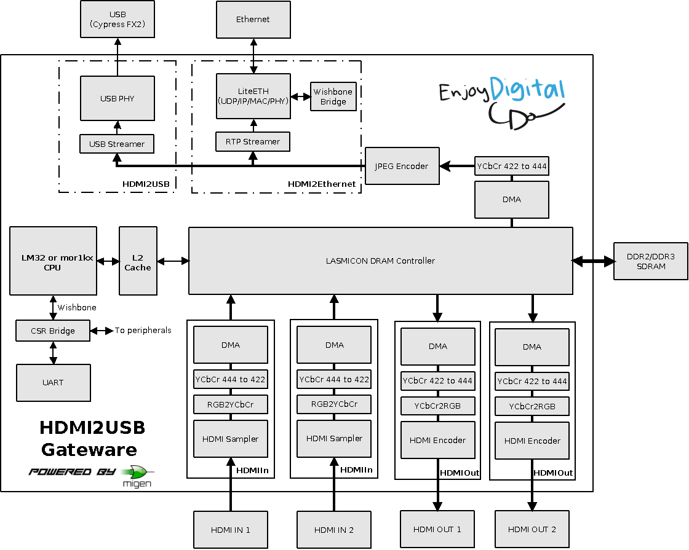

# HDMI2USB MiSoC Firmware

## Quick Links

 * [HDMI2USB user documentation](http://hdmi2usb.tv/)
 * [HDMI2USB Firmware documentation](https://hdmi2usb.tv/firmware-misoc)
 * [Report a bug](https://github.com/timvideos/HDMI2USB-misoc-firmware/issues/new)
 * [misoc + migen website](http://m-labs.hk/gateware.html)

# Table of contents

  * Overview
  * HDMI2USB MiSoC Firmware
    * Supported Boards
    * In Progress Boards
    * Other Boards
  * Getting started
  * Documentation
  * License
  * Contact

# Overview

**The HDMI2USB project develops affordable hardware options to record and
stream HD videos (from HDMI & DisplayPort sources) for conferences, meetings
and user groups.**

We are currently developing our own hardware (the
[Numato Opsis](https://hdmi2usb.tv/numato-opsis), and also provide firmware for
various prototyping boards.

HDMI2USB started in 2013, and is an active ongoing project in its third
iteration of hardware prototyping.  Today you can download early working
firmware and have real capture happen, but we actively wish to improve and are
seeking assistance:

  * **For video recording individuals+teams:** Be an early adopter; get a
    board, start using it, report back to us with feedback

  * **For software/FPGA developers:** Get involved in contributing code both to
    the capture software + FPGA stack

Our aim is this becomes the defacto, incredibly affordable and easy to use
video recording hardware for conferences, meetings and user groups worldwide.

**Find out more about HDMI2USB and why we're doing this in [ABOUT + FAQ](http://hdmi2usb.tv/faq)**

# HDMI2USB MiSoC Firmware

## Supported Boards

This firmware is supported on the following to boards for capturing
conferences;

 * [Digilent Atlys](https://hdmi2usb.tv/digilent-atlys/) - `PLATFORM=atlys` - http://digilentinc.com/atlys/

   The original board used for HDMI2USB prototyping.

   

 * [Numato Opsis](https://hdmi2usb.tv/numato-opsis/) - `PLATFORM=opsis` - https://crowdsupply.com/numato-lab/opsis

   The first production board made in conjunction with TimVideos.us project.

   

For a comparison between the supported boards, see the
[HDMI2USB Hardware page](https://hdmi2usb.tv/hardware/).

## In Progress Boards

The following boards are under development for conference capture;

 * Digilent Nexys Video
 * Alphamax NeTV2

## Other Boards

The following boards are useful for development but *not* conference capture;

 * Saanlima Pipistrello - http://pipistrello.saanlima.com/

   `PLATFORM=pipistrello`

   A small FPGA board with only one HDMI output port.
   Due to the lack of video *inputs*, this board is only useful for developers.

 * ScarabHardware miniSpartan6+ - https://www.scarabhardware.com/minispartan6/ -
   [*In progress*](https://github.com/timvideos/HDMI2USB-misoc-firmware/tree/minispartan6%2B)

   `PLATFORM=miniSpartan`

   A small FPGA board with HDMI input and HDMI output.
   Due to the low speed ram and USB interface, this board is only useful for
   developers who want to work on the HDMI subsystem and need a small board
   that fits in their pocket.

 * Numato MimasV2 - https://numato.com/mimas-v2-spartan-6-fpga-development-board-with-ddr-sdram/

   `PLATFORM=mimasv2`

   A small, cheap FPGA board with a Spartan 6 and DDR RAM. Due to the lack of
   video input and high speed data interfaces this board can't be used for
   capture. It can however be used for development of non-capture related
   firmware features and experimenting with FPGA development.

# Getting started

For **using** a HDMI2USB board, prebuilt versions of the firmware are available in
the
[HDMI2USB-firmware-prebuilt](http://github.com/timvideos/HDMI2USB-firmware-prebuilt)
repository.

For **helping with the development**, instructions for setting up the build
environment are found in the [getting-started.md](getting-started.md) file.

# Documentation

**User** documentation is found on the [HDMI2USB website](https://hdmi2usb.tv).

High level **developer** documentation for the firmware can be found in the
[doc](doc/) directory. More documentation is found in the source code.

# License

This code was developed by the people found in the [AUTHORS](AUTHORS) file
(including major contributions from [EnjoyDigital](http://enjoy-digital.fr))
and released under a [BSD/MIT license](LICENSE).

Code under the [third_party](third_party/) directory comes from external
sources and is available in their own licenses.

# Contact

TimVideo.us:

 * Mailing List:
   * https://groups.google.com/forum/#!forum/hdmi2usb
     [[Join](https://groups.google.com/forum/#!forum/hdmi2usb/join)]
   * hdmi2usb@googlegroups.com

 * IRC:
   * irc://irc.freenode.net/#timvideos
     [[Web Interface](http://webchat.freenode.net/?channels=timvideos)]

EnjoyDigital:
 * florent@enjoy-digital.fr
